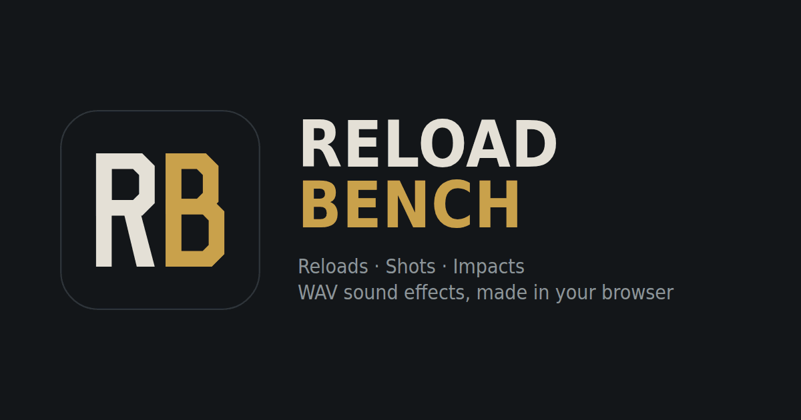

# Reload Bench

A browser-based sound design tool for game developers. It synthesizes weapon foley from scratch (reload sequences,
single gunshots and bullet impacts) and exports the results as WAV files ready to drop into a game engine.

**Try it:** https://joonas98.github.io/reload-bench/

Every sound is generated in the visitor's browser with the Web Audio API. There are no recorded samples and nothing is
uploaded anywhere, so everything you export is yours to use.

## Features

### Reload: step sequence
- Eight weapon platforms: pistol, rifle, SMG, pump shotgun, revolver, bolt action, LMG and energy rifle.
- Each reload is a sequence of steps (mag out, mag in, bolt back and so on) with a timing marker for the frame the
  sound should sync to. Markers can be dragged on the waveform or typed in, steps can be added, removed or muted, and
  the clip length can be changed with the steps following along.
- Shape controls for weight, metal, grit and room, plus tone variation and optional timing drift between takes.

### Shot: single fire
- Presets from pistol and SMG to sniper, pump shotgun and energy rifle.
- Layers for crack, blast, punch, mechanics and casing drop, placed indoors, outdoors or in an urban space, with an
  optional suppressor and adjustable caliber, distance and reverb tail.
- The shot starts 12 ms into the clip so it plays the instant a game triggers it.

### Impact: bullet hits
- Eight surfaces: flesh, body armor, wood, dirt, rock, metal, glass and water.
- Layers for snap, body, wet, tear, debris, crunch and ricochet, with force, distance, environment and a headshot
  option.
- The hit lands 5 ms into the clip.

### Export
- **Export this take** downloads the current sound as a single WAV.
- **Export 6 takes / variations** downloads a ZIP of six variations to use as round-robin sounds, so repeated reloads,
  shots and hits never sound identical in-game.
- Files are 44.1 kHz, 16-bit stereo, trimmed to the clip length and peak-normalized.

### Shortcuts
| Key | Action |
|---|---|
| `Space` | Play |
| `V` | New take |
| `Shift` + drag | Fine adjustment |

## How it works

The whole app is a single `index.html` with inline CSS and JavaScript and no dependencies. Each layer is synthesized
sample by sample in JavaScript into audio buffers, then mixed and rendered with an `OfflineAudioContext`, including a
generated impulse response for the room or environment reverb. Randomness comes from a seeded generator: the take number
shown in the app is the seed, so the same take with the same settings always produces the same sound. WAV encoding and
the ZIP archive for batch exports are written by hand in JavaScript, so no libraries are needed.

## Project structure

```
index.html              the whole app: markup, styles and script
og-image.png            link preview image for Discord, Slack, X and similar
reload-bench-logo.svg   logo in vector form
favicon.*, icon-*.png   browser, home-screen and install icons
site.webmanifest        web app manifest
```

## Running locally

There is no build step. Open `index.html` directly in a browser, or serve the folder with any static server:

```
python -m http.server 8000
```

Fonts load from Google Fonts. Offline, the page falls back to system fonts and still works.

## Deployment

The repository root is the site. It is published with GitHub Pages from the `main` branch, and it works unchanged on
any static host (Netlify, Cloudflare Pages, itch.io as an HTML project, or a plain web server).
